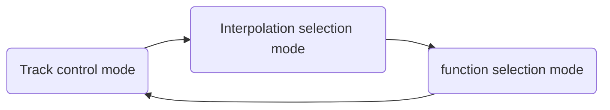

# About this repository
This repository contains the software part of my diy-audio project that features an XMOS xCORE-200 embedded processor.
For the associated hardware project, please refer to https://github.com/sa9ra1xken/hw_xSSDAC. 

# USB DAC and SD audio player application    
"Module app_usb_sdc_ssdac_xSSDAC-SD-V2" included in this repository is an implementation of a USB DAC and SD card audio player function that runs on the [Hardware](https://github.com/sa9ra1xken/hw_xSSDAC).

## Feature
USB audio and SD audio player functions can be selectable on the menu screen.
* USB Audio supports incoming stream up to 24bit stereo @ 384Ksps (depending on interpolation mode).
* SD audio player supports linear PCM AVI and Flac format files up to 24bit stereo @ 192Ksps (depending on interpolation mode)

## Interpolation and DAC control
In this implementation, the interpolation process corresponding to so-called oversampling is not performed by hardware but by software. 
Instead of conventional FIR-filter-based interpolation, this implementation uses cubic spline interpolation that was introduced as [SSDAC](https://www.cqpub.co.jp/toragi/2008-2020/tabid/879/Default.html) in "トランジスタ技術" magazine, issue of October 2018.

Not only cubic spline interpolation, but the below types of interpolation modes are selectable by the menu screen.
* SSDAC (Cubic spline interpolation), the maximum supersampling factor of 32 depending on the source sample rate.  
* NOS (no oversampling)
* linear approximation
* SINC-function-based FIR filter for oversampling factor of 4
* SINC-function-based FIR filter for oversampling factor of 8
  
## Operation Console 
Consists of a four-line character display and 7 push button switches.

The state of the console consists of the following 3 modes. The console mode changes by pressing SW7.    

### In track control mode
Button   |SW1            |SW2          |SW3       |SW4           |SW6        |SW5 |SW7
---------|---------------|-------------|----------|--------------|-----------|----|---
Click    |Previous track |rewind 10 sec|Stop/Start|foreward 10sec|Next track |    |Console mode
Hold down|Previous folder|             |          |              |Next folder|    |

### In Interpolation selection mode
Button   |SW1            |SW2          |SW3       |SW4           |SW6        |SW5 |SW7
---------|---------------|-------------|----------|--------------|-----------|----|---
Click    |SSDAC          |Step (NOS)   |Linear    |FIR x 4       |FIR x 8    |    |Console mode

### In Function selection mode
Button   |SW1            |SW2          |SW3       |SW4           |SW6        |SW5 |SW7
---------|---------------|-------------|----------|--------------|-----------|----|---
Click    |USB DAC        |SD player    |          |              |           |    |

The selected function takes effect on the next boot (reset button).
 
# Development environment

xTIMEcomposer 14.4.1. later versions may be ok though Auther has not tried.  
